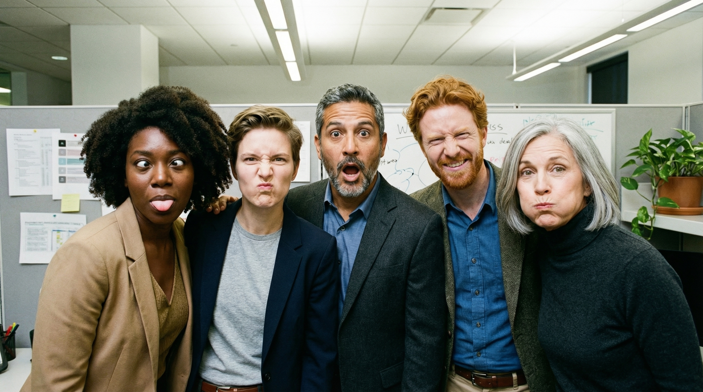

## Vision Interpret

Interpretability toolkit for vision models, focused on **attention map visualization for Vision Transformers (ViTs)** and designed to be easily extended to **CNNs and other vision architectures**.

The project provides a small set of modular components to:

- **Load media** (`ImageProcessor`, `VideoProcessor`)
- **Compute global attention rollout** for ViTs (`VitAttentionProcessor`)
- **Turn attentions into smooth heatmaps**
- **Blend heatmaps back onto the original image or video frames**

This makes it simple to inspect **where a model is looking** when it makes a prediction!

---

## Example: Original image vs. Attention Mask of the image

- **Original image** – plain visual input:



- **Vision Transformer attention overlay** – attention rollout visualized as a soft transparency mask:


---

## Installation

This project is packaged as a standard Python module (see `pyproject.toml`). A typical setup looks like:

```bash
pip install -e .
```

Make sure you have the following core dependencies installed (directly or via the project):

- `torch`
- `transformers`
- `Pillow`
- `opencv-python`
- `numpy`

---

## Quickstart: Visualizing ViT Attention on Images

The snippet below shows how to:

- Load a pretrained ViT from Hugging Face.
- Wrap it with `VitAttentionProcessor`.
- Run the end‑to‑end attention visualization on a single image using `ImageProcessor`.

```python
from transformers import ViTForImageClassification, ViTImageProcessor
from PIL import Image

from visioninterpret.vit import VitAttentionProcessor
from visioninterpret.media import ImageProcessor

# 1. Load a pretrained ViT backbone (compatible with Hugging Face)
model_name = "google/vit-base-patch16-224"
processor = ViTImageProcessor.from_pretrained(model_name)
model = ViTForImageClassification.from_pretrained(model_name)
model.eval()

# 2. Wrap the model with the interpretability processor
vit_attention = VitAttentionProcessor(processor=processor, model=model)

# 3. Use the media helper to run the pipeline and save the overlay
image_processor = ImageProcessor()

input_path = "assets/office_group.jpeg"
output_path = "assets/office_group_processed_from_readme.png"

overlay_image = image_processor.process(path=input_path, processor=vit_attention)
image_processor.save(path=output_path, image=overlay_image)

print(f"Saved attention overlay to {output_path}")
```

Run this script and compare the output image with the example attention overlay to get an intuition for how the model focuses on different people or regions in the scene.

---

## Quickstart: Visualizing ViT Attention on Videos

The same pipeline can be applied frame‑by‑frame to a video:

```python
from transformers import ViTForImageClassification, ViTImageProcessor
import numpy as np

from visioninterpret.vit import VitAttentionProcessor
from visioninterpret.media import VideoProcessor

model_name = "google/vit-base-patch16-224"
processor = ViTImageProcessor.from_pretrained(model_name)
model = ViTForImageClassification.from_pretrained(model_name)
model.eval()

vit_attention = VitAttentionProcessor(processor=processor, model=model)
video_processor = VideoProcessor()

input_video = "examples/input.mp4"
output_video = "examples/input_with_attention.mp4"

# Process frames one by one and collect overlays
frames = []
for frame_overlay in video_processor.process(path=input_video, processor=vit_attention):
    # Ensure we store numpy arrays compatible with OpenCV video writing
    frames.append(np.array(frame_overlay))
frames = np.array(frames)
video_processor.save(path=output_video, frames=frames)

print(f"Saved attention-overlay video to {output_video}")
```

This produces a new video where each frame shows the ViT’s attention focus as a soft overlay, making it easier to debug temporal behavior in action recognition, tracking, or surveillance tasks.

---

## Compatibility with Other Vision Transformer Models

The current implementation targets **Hugging Face ViT models**, but the design is intentionally flexible.

- **Expected model API**
  - Any model compatible with `transformers.ViTForImageClassification` (or with a similar interface) should work as long as:
    - The forward pass accepts `output_attentions=True`.
    - The returned `attentions` attribute is a list of tensors of shape `[batch, heads, tokens, tokens]`.
  - Any processor compatible with `transformers.ViTImageProcessor` can be used to preprocess images into tensors.

- **Using a different ViT variant**

```python
from transformers import ViTForImageClassification, ViTImageProcessor
from visioninterpret.vit import VitAttentionProcessor

model_name = "facebook/vit-mae-base"  # or any other ViT-like model
processor = ViTImageProcessor.from_pretrained(model_name)
model = ViTForImageClassification.from_pretrained(model_name)

vit_attention = VitAttentionProcessor(processor=processor, model=model)
```

If the model follows the same attention layout, no further changes should be required. For architectures with different token structures (e.g. extra special tokens, no explicit class token, or non‑square patch layouts), you can subclass `VitAttentionProcessor` and adjust:

- How the **class token attention** is selected.
- How the **patch grid shape** is computed from the number of tokens.

---

## Extending Beyond ViTs (CNNs and Other Backbones)

Although the reference implementation focuses on ViTs, the abstractions (`Processor`, `MediaProcessor`, `ImageProcessor`, `VideoProcessor`) are deliberately model‑agnostic:

- For **CNNs**, you might implement:
  - Grad‑CAM or Grad‑CAM++ on convolutional feature maps.
  - Layer‑wise relevance propagation (LRP) or guided backpropagation.
  - Spatial attention from intermediate activation maps.
- For **hybrid or modern architectures** (e.g. Swin, ConvNeXt, DeiT, ViT‑Hybrid), you can:
  - Reuse the same media stack.
  - Implement a new `Processor` subclass that:
    - Handles any necessary reshaping of tokens or feature maps.
    - Produces a final `PIL.Image` or `numpy.ndarray` overlay suitable for saving.

This project aims to be a **lightweight playground** where new interpretability ideas for vision can be implemented and compared with minimal boilerplate.

---

## Project Structure (High Level)

- `visioninterpret/`
  - `media.py` – image and video loading/processing/saving helpers.
  - `processor.py` – abstract `Processor` base class.
  - `vit.py` – `VitAttentionProcessor` with global attention rollout and overlay utilities.
- `assets/`
  - `office_group.jpeg` – original reference image.
  - `office_group_processed.jpeg` – example attention overlay generated by a ViT.

---

## Contributing

Contributions are very welcome, especially around **new interpretability methods for vision models**. Some ideas:

- Add processors for:
  - CNN‑based Grad‑CAM / Grad‑CAM++.
  - Layer relevance propagation for ResNets or EfficientNet.
  - Token attribution for DEtection or segmentation transformers.
- Improve media utilities:
  - Batch processing and CLI interfaces.
  - Interactive notebooks or web dashboards for exploring attention.
- Enhance compatibility:
  - Support more Hugging Face models (Swin, ConvNeXt, DeiT, MAE, etc.).
  - Add tests to verify rollout correctness across architectures.

If you would like to contribute:

1. **Fork** the repository.
2. Create a feature branch: `git checkout -b feature/my-idea`.
3. Implement your changes with clear, minimal APIs.
4. Add or update examples/notebooks where relevant.
5. Open a **pull request** with a short description and usage notes.
